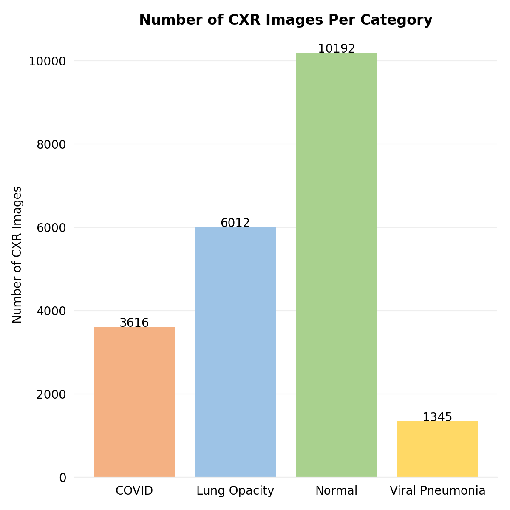
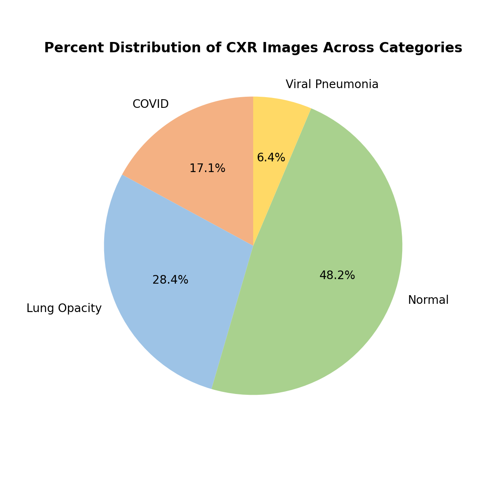

# :lungs: Chest-X-Ray Classification 

This project classifies chest X-ray images using a modified ResNet-50 neural network model.

## Contents
 
- [Technologies](#technologies)
- [Dataset description](#dataset-description)
- [Data preprocessing](#data-preprocessing) 
- [Methodology](#methodology) 
- [Results](#results) 
- [Code style](#code-style)
- [Requirements](#requirements)
- [Credits](#credits)

## Technologies

## Dataset description

The dataset was sourced from [Kaggle](https://www.kaggle.com/datasets/tawsifurrahman/covid19-radiography-database). 
Researchers from Qatar University and University of Dhaka, along with their collaborators from Pakistan and Malaysia, 
created this dataset of chest X-ray (CXR) images. 

They released 3616 COVID, 6012 Lung Opacity, 10192 Normal, and 1345 Viral Pneumonia CXR images.

Every image was PNG, grayscale, and 299 x 299 pixels. 

## Data preprocessing

Images were processed using `tf.keras.applications.resnet50.preprocess_input`, which converts images from RGB to BGR 
and then zero-centers each color channel with respect to the ImageNet dataset without scaling.

In addition, real-time data augmentation was done via ImageDataGenerator.
The table below summarizes the parameters used.

For visualization purposes, some augmented pictures were saved to the aug_images folder via the `save_to_dir` arg. 
Below are a few of those images. 

## Methodology

First, a ResNet-50 neural network model was implemented from scratch
and pre-trained ImageNet weights were loaded into it via transfer learning.
Next, bottleneck layers were added, namely a global average pooling layer and 3 fully connected layers, 
containing 2048, 512, and 128 neurons respectively.
Then, a fully connected layer with softmax classifier was added at the end. 
Lastly, the base model layers were frozen, 
rendering 5,311,620 trainable parameters and 23,587,712 non-trainable parameters.

After the model was built, it was fed batches of augmented images. 
The images were in rgb mode and 224 x 224 in size for ImageNet compatibility reasons.
The images were trained for 20 epochs with a learning rate of 0.0001.
70% of the CXR images were used for testing, 10% for validating, and 20% for testing.

|                    | **Training** | **Validation** | **Testing** |
| ------------------ | ------------ | -------------- | ----------- |
| **Number of CXRs** | 10124        | 1444           | 2896        |

## Results

### Training Results

### Testing Results 

After training, the test subset was evaluated. 
The table below summarizes the metrics for the model in test mode.

| Loss  | Accuracy | Precision | Recall |
| ----- | -------- | --------- | ------ |
| 0.207 | 0.928    | 0.933     | 0.926  |

Next, output predictions were generated for the test input samples. 
These predictions were then compared to the true label values.
The classification report and confusion matrix below summarize the results. 

See `sklearn.metrics.classification_report` and `sklearn.metrics.ConfusionMatrixDisplay` for more details. 

## Code style

## Requirements

Third party / library specific imports: matplotlib, numpy, IPython, PIL, sklearn, tensorflow

## Credits

- He, K., Zhang, X., Ren, S., & Sun, J. (2015). Deep Residual Learning for Image Recognition (Version 1). arXiv. https://doi.org/10.48550/ARXIV.1512.03385
- M.E.H. Chowdhury, T. Rahman, A. Khandakar, R. Mazhar, M.A. Kadir, Z.B. Mahbub, K.R. Islam, M.S. Khan, A. Iqbal, N. Al-Emadi, M.B.I. Reaz, M. T. Islam, “Can AI help in screening Viral and COVID-19 pneumonia?” IEEE Access, Vol. 8, 2020, pp. 132665 - 132676. 
- Rahman, T., Khandakar, A., Qiblawey, Y., Tahir, A., Kiranyaz, S., Kashem, S.B.A., Islam, M.T., Maadeed, S.A., Zughaier, S.M., Khan, M.S. and Chowdhury, M.E., 2020. Exploring the Effect of Image Enhancement Techniques on COVID-19 Detection using Chest X-ray Images.